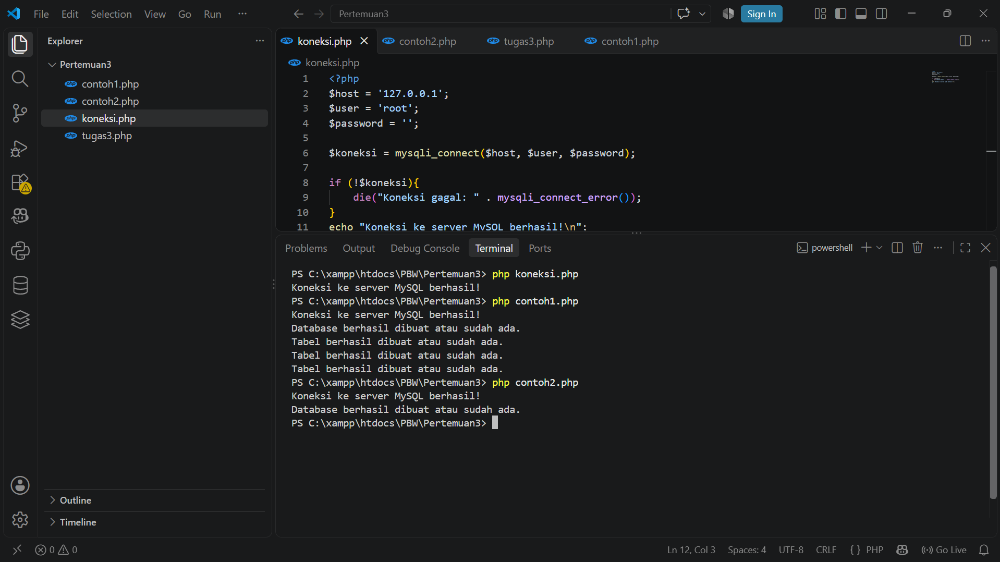
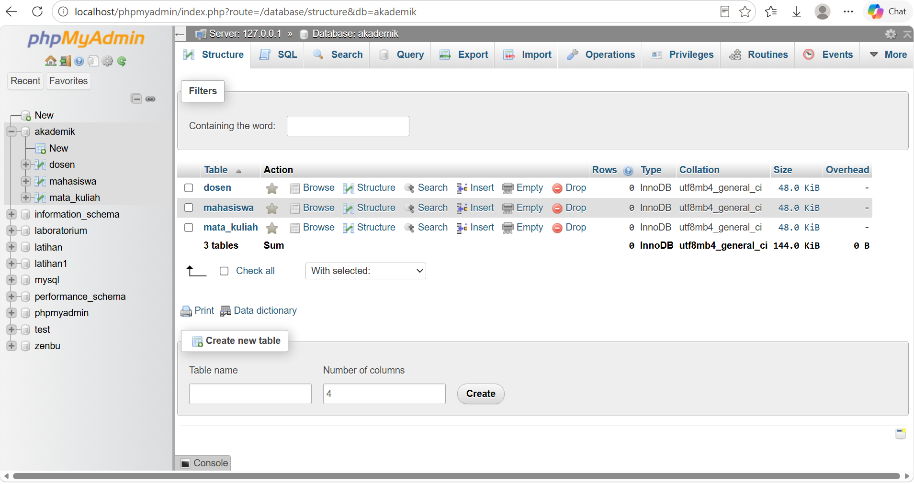
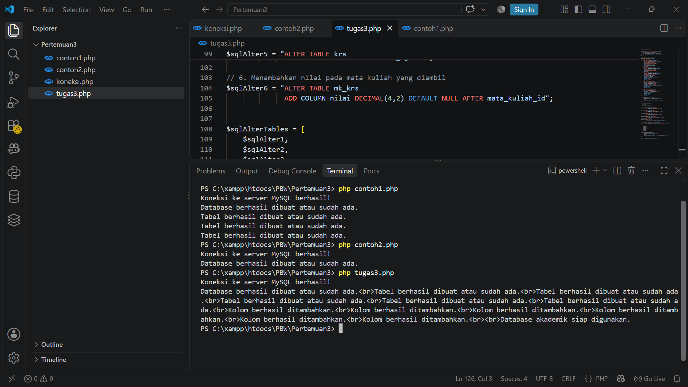
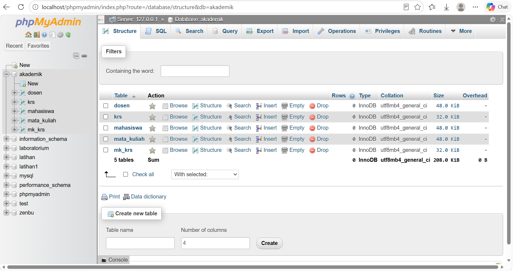

<div align="center"> 
 
<h1 style="font-size: 18px; margin-bottom: 5px; border: none;"> 
LAPORAN PRAKTIKUM <br> 
PEMROGRAMAN BERBASIS WEB 
</h1> 
 
<p style="font-size: 12px; color: #555;"> 
<i>"Laporan ini disusun untuk memenuhi salah satu penilaian mata kuliah Praktikum Pemrograman Berbasis Web"</i> 
</p> 
 
<br> 
 
 
 
<br><br> 
 
<p style="font-size: 14px; margin-bottom: 5px;"> 
<b>Disusun Oleh:</b> 
</p> 
 
<p style="font-size: 15px; margin-top: 5px;"> 
Rihhadatul Aisy Septifani Zain<br> 
4524210126 
</p> 
 
<br> 
 
<p style="font-size: 14px; margin-bottom: 5px;"> 
<b>Dosen:</b> 
</p> 
 
<p style="font-size: 14px; margin-top: 5px;"> 
Ari Wibowo, S.Kom., M.Kom., C. Pro 
</p> 
 
<br><br><br> 
 
<h3 style="font-size: 16px; margin-bottom: 5px; border: none;"> 
S1-TEKNIK INFORMATIKA <br> 
FAKULTAS TEKNIK UNIVERSITAS PANCASILA <br> 
<b>2026/2027</b> 
</h3> 
 
</div> 
 
--- 
 
# TUGAS 3 
 
## 1. Menjalankan Program Sebelum Modifikasi 
 
Program `tugas3.php` dijalankan terlebih dahulu untuk memastikan proses pembuatan database dan tabel dapat berjalan dengan baik. 
 
Program ini digunakan untuk membuat database `akademik` dan beberapa tabel yang berhubungan dengan data akademik. 
 
### Tampilan sebelum dilakukan modifikasi 
 
 

### Kode Program Sebelum Modifikasi


 
--- 
 
# 2. Modifikasi Program 
 
## A. Modifikasi pada `tugas3.php` 
 
### Tampilan Sesudah Modifikasi 
 


### Kode Program Sesudah Modifikasi


 
### 1.) Menambahkan proses perulangan untuk membuat tabel 
 
Pada program ditambahkan `foreach` untuk menjalankan seluruh query yang terdapat pada array `$sqlCreateTables`. Dengan menggunakan perulangan ini, setiap tabel dapat dibuat secara otomatis satu per satu. 
 
**Code:** 
 
```php 
foreach ($sqlCreateTables as $sql) { 
    if (mysqli_query($koneksi, $sql)) { 
        echo "Tabel berhasil dibuat atau sudah ada.<br>"; 
    } else { 
        echo "Error membuat tabel: " . mysqli_error($koneksi) . "<br>"; 
    } 
} 
``` 
 
--- 
 
### 2.) Mengatur relasi tabel `mk_krs` 
 
Tabel `mk_krs` memiliki kolom `krs_id` yang digunakan untuk menghubungkan data dengan tabel `krs`. Relasi dibuat menggunakan `FOREIGN KEY`. 
 
**Code:** 
 
```php 
CONSTRAINT fk_mkkrs_krs 
FOREIGN KEY (krs_id) 
REFERENCES krs(id) 
ON UPDATE CASCADE 
ON DELETE CASCADE 
``` 
 
Dengan relasi tersebut, data pada `mk_krs` dapat berhubungan dengan data KRS yang terdapat pada tabel `krs`. 
 
--- 
 
### 3.) Menambahkan nomor telepon dan alamat mahasiswa 
 
Pada tabel `mahasiswa` ditambahkan kolom `no_telp` dan `alamat` untuk menyimpan informasi tambahan mahasiswa. 
 
**Code:** 
 
```php 
$sqlAlter1 = "ALTER TABLE mahasiswa 
              ADD COLUMN no_telp VARCHAR(15) AFTER email"; 
 
$sqlAlter2 = "ALTER TABLE mahasiswa 
              ADD COLUMN alamat VARCHAR(200) AFTER no_telp"; 
``` 
 
`ALTER TABLE` digunakan untuk mengubah struktur tabel yang sudah dibuat dengan menambahkan kolom baru. 
 
--- 
 
### 4.) Menambahkan jabatan dosen 
 
Pada tabel `dosen` ditambahkan kolom `jabatan` untuk menyimpan informasi mengenai jabatan dosen. 
 
**Code:** 
 
```php 
$sqlAlter3 = "ALTER TABLE dosen 
              ADD COLUMN jabatan VARCHAR(50) AFTER email"; 
``` 
 
--- 
 
### 5.) Menambahkan semester mata kuliah 
 
Pada tabel `mata_kuliah` ditambahkan kolom `semester` untuk menyimpan informasi semester mata kuliah. 
 
**Code:** 
 
```php 
$sqlAlter4 = "ALTER TABLE mata_kuliah 
              ADD COLUMN semester TINYINT UNSIGNED AFTER sks"; 
``` 
 
--- 
 
### 6.) Menambahkan status KRS 
 
Pada tabel `krs` ditambahkan kolom `status` dengan tipe `ENUM`. Status yang tersedia adalah `Aktif`, `Selesai`, dan `Batal`. 
 
**Code:** 
 
```php 
$sqlAlter5 = "ALTER TABLE krs 
              ADD COLUMN status ENUM('Aktif', 'Selesai', 'Batal') 
              DEFAULT 'Aktif' AFTER tahun_ajaran"; 
``` 
 
Nilai default yang digunakan adalah `Aktif`. 
 
--- 
 
### 7.) Menambahkan nilai pada `mk_krs` 
 
Pada tabel `mk_krs` ditambahkan kolom `nilai` untuk menyimpan nilai mahasiswa pada mata kuliah yang diambil. 
 
**Code:** 
 
```php 
$sqlAlter6 = "ALTER TABLE mk_krs 
              ADD COLUMN nilai DECIMAL(4,2) DEFAULT NULL AFTER mata_kuliah_id"; 
``` 
 
--- 
 
# 3. Menjalankan Query `ALTER TABLE` 
 
Setelah seluruh query untuk menambahkan kolom dibuat, query tersebut dimasukkan ke dalam array `$sqlAlterTables`. 
 
**Code:** 
 
```php 
$sqlAlterTables = [ 
    $sqlAlter1, 
    $sqlAlter2, 
    $sqlAlter3, 
    $sqlAlter4, 
    $sqlAlter5, 
    $sqlAlter6 
]; 
``` 
 
Kemudian seluruh query dijalankan menggunakan `foreach`. 
 
**Code:** 
 
```php 
foreach ($sqlAlterTables as $sql) { 
    if (mysqli_query($koneksi, $sql)) { 
        echo "Kolom berhasil ditambahkan.<br>"; 
    } else { 
        echo "Kolom gagal ditambahkan: " . mysqli_error($koneksi) . "<br>"; 
    } 
} 
``` 
 
Dengan menggunakan `foreach`, seluruh query `ALTER TABLE` dapat dijalankan secara berurutan tanpa harus menuliskan proses eksekusi satu per satu. 
 
--- 
 
# 4. Hasil Modifikasi 
 
Setelah seluruh perubahan dilakukan, program dijalankan kembali untuk memastikan database, tabel, dan kolom tambahan berhasil dibuat. 
 
### Tampilan setelah dilakukan modifikasi 
 
 
 
Program menampilkan pesan bahwa tabel berhasil dibuat atau sudah tersedia dan kolom berhasil ditambahkan. 
 
--- 
 
# 5. Lima Bagian Kode yang Penting 
 
## 1.) Membuat Database 
 
Kode berikut digunakan untuk membuat database `akademik`. 
 
**Code:** 
 
```php 
$sqlCreateDB = "CREATE DATABASE IF NOT EXISTS akademik"; 
``` 
 
`IF NOT EXISTS` digunakan agar database tidak dibuat ulang apabila database `akademik` sudah tersedia. 
 
--- 
 
## 2.) Membuat Tabel dengan `foreach` 
 
Kode berikut digunakan untuk menjalankan query pembuatan tabel yang disimpan di dalam array `$sqlCreateTables`. 
 
**Code:** 
 
```php 
foreach ($sqlCreateTables as $sql) { 
    if (mysqli_query($koneksi, $sql)) { 
        echo "Tabel berhasil dibuat atau sudah ada.<br>"; 
    } 
} 
``` 
 
Dengan menggunakan `foreach`, setiap query dapat dijalankan secara berurutan. 
 
--- 
 
## 3.) Menambahkan Kolom dengan `ALTER TABLE` 
 
Kode berikut digunakan untuk menambahkan kolom baru pada tabel `mahasiswa`. 
 
**Code:** 
 
```php 
ALTER TABLE mahasiswa 
ADD COLUMN no_telp VARCHAR(15) AFTER email 
``` 
 
`ALTER TABLE` digunakan untuk mengubah struktur tabel yang sudah dibuat, salah satunya dengan menambahkan kolom baru. 
 
--- 
 
## 4.) Membuat Relasi dengan `FOREIGN KEY` 
 
Kode berikut digunakan untuk menghubungkan tabel `mk_krs` dengan tabel `krs`. 
 
**Code:** 
 
```php 
FOREIGN KEY (krs_id) 
REFERENCES krs(id) 
``` 
 
`FOREIGN KEY` digunakan agar data dari satu tabel dapat memiliki hubungan dengan data pada tabel lainnya. 
 
--- 
 
## 5.) Menggunakan `ENUM` untuk Status 
 
Kode berikut digunakan untuk membuat kolom `status` pada tabel `krs`. 
 
**Code:** 
 
```php 
ADD COLUMN status ENUM('Aktif', 'Selesai', 'Batal') 
DEFAULT 'Aktif' 
``` 
 
`ENUM` digunakan agar nilai yang dapat dimasukkan ke dalam kolom `status` hanya sesuai dengan pilihan yang sudah ditentukan. 
 
--- 
 
# Kesimpulan 
 
Pada tugas ini, saya membuat database `akademik` beserta tabel `mahasiswa`, `dosen`, `mata_kuliah`, `krs`, dan `mk_krs`. Saya juga menambahkan beberapa kolom baru seperti nomor telepon, alamat, jabatan, semester, status KRS, dan nilai. Selain itu, saya menggunakan `FOREIGN KEY` untuk membuat relasi antar tabel dan `foreach` untuk menjalankan beberapa query secara berurutan.
