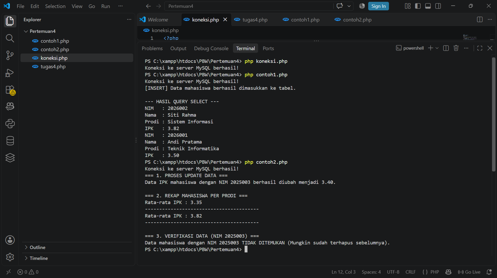
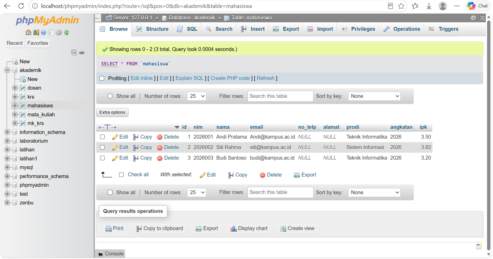
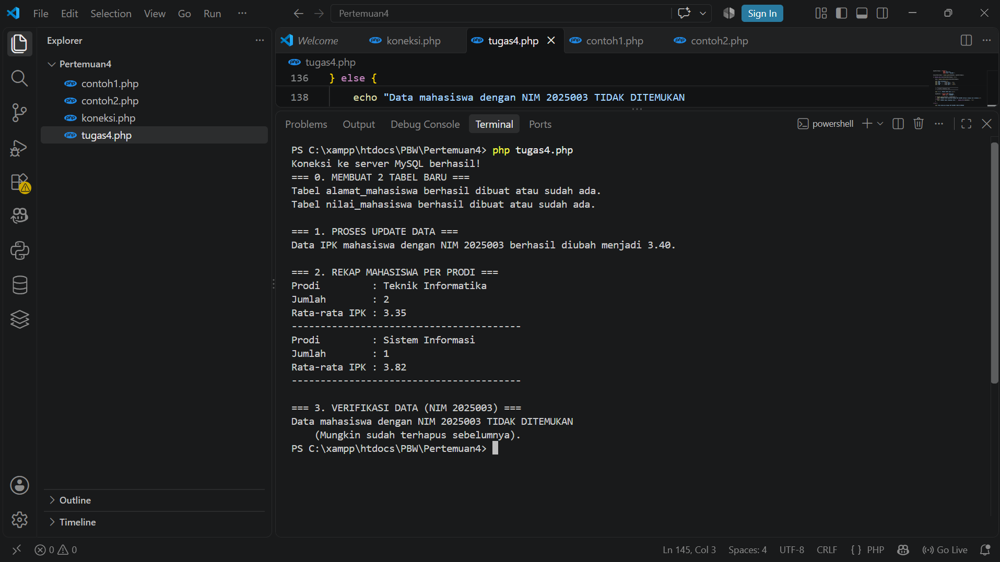
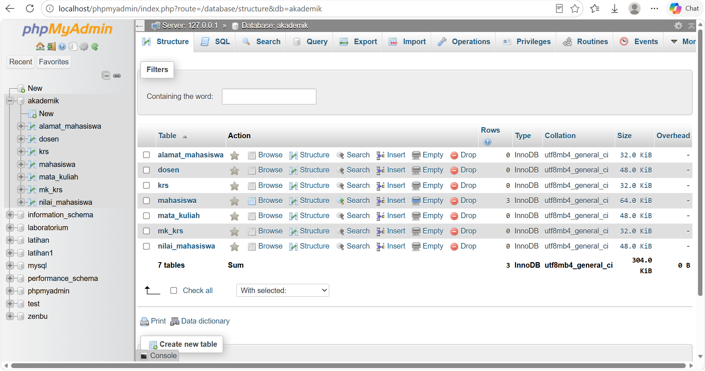

<div align="center"> 
 
<h1 style="font-size: 18px; margin-bottom: 5px; border: none;"> 
LAPORAN PRAKTIKUM <br> 
PEMROGRAMAN BERBASIS WEB 
</h1> 
 
<p style="font-size: 12px; color: #555;"> 
<i>"Laporan ini disusun untuk memenuhi salah satu penilaian mata kuliah Praktikum Pemrograman Berbasis Web"</i> 
</p> 
 
<br> 
 
 
 
<br><br> 
 
<p style="font-size: 14px; margin-bottom: 5px;"> 
<b>Disusun Oleh:</b> 
</p> 
 
<p style="font-size: 15px; margin-top: 5px;"> 
Rihhadatul Aisy Septifani Zain<br> 
4524210126 
</p> 
 
<br> 
 
<p style="font-size: 14px; margin-bottom: 5px;"> 
<b>Dosen:</b> 
</p> 
 
<p style="font-size: 14px; margin-top: 5px;"> 
Ari Wibowo, S.Kom., M.Kom., C. Pro 
</p> 
 
<br><br><br> 
 
<h3 style="font-size: 16px; margin-bottom: 5px; border: none;"> 
S1-TEKNIK INFORMATIKA <br> 
FAKULTAS TEKNIK UNIVERSITAS PANCASILA <br> 
<b>2026/2027</b> 
</h3> 
 
</div> 
 
--- 
 
# TUGAS 4 
 
## Menjalankan Program Sebelum Modifikasi 
 
Program tugas4.php dijalankan terlebih dahulu untuk memastikan proses pengolahan data pada database dapat berjalan dengan baik. 
 
### Program Sebelum Modifikasi
 
 

### Tampilan sebelum dilakukan modifikasi 


 
--- 
 
# Modifikasi Program 
 
## A. Modifikasi pada tugas4.php
 
### Program Sesudah Modifikasi
 


### Tampilan Sesudah Modifikasi


 
### 1.) Menambahkan tabel alamat mahasiswa 
 
Pada program ditambahkan tabel baru bernama alamat_mahasiswa untuk menyimpan alamat dan kota mahasiswa. Tabel ini memiliki relasi dengan tabel mahasiswa menggunakan FOREIGN KEY. 
 
**Code:** 
 
```php
$sqlTabel1 = "CREATE TABLE IF NOT EXISTS alamat_mahasiswa ( 
    id BIGINT UNSIGNED AUTO_INCREMENT PRIMARY KEY, 
    mahasiswa_id BIGINT UNSIGNED NOT NULL, 
    alamat VARCHAR(200) NOT NULL, 
    kota VARCHAR(50) NOT NULL, 
    CONSTRAINT fk_alamat_mahasiswa 
    FOREIGN KEY (mahasiswa_id) REFERENCES mahasiswa(id) 
    ON UPDATE CASCADE 
    ON DELETE CASCADE 
) ENGINE=InnoDB"; 
``` 
 
FOREIGN KEY digunakan agar data alamat dapat terhubung dengan data mahasiswa. ON UPDATE CASCADE dan ON DELETE CASCADE digunakan agar perubahan atau penghapusan data mahasiswa dapat diterapkan pada data yang berhubungan. 
 
--- 
 
### 2.) Menambahkan tabel nilai mahasiswa 
 
Pada program ditambahkan tabel nilai_mahasiswa untuk menyimpan nilai mahasiswa berdasarkan mata kuliah yang diambil. 
 
**Code:** 
 
```php
$sqlTabel2 = "CREATE TABLE IF NOT EXISTS nilai_mahasiswa ( 
    id BIGINT UNSIGNED AUTO_INCREMENT PRIMARY KEY, 
    mahasiswa_id BIGINT UNSIGNED NOT NULL, 
    mata_kuliah_id BIGINT UNSIGNED NOT NULL, 
    nilai DECIMAL(5,2) NOT NULL, 
    CONSTRAINT fk_nilai_mahasiswa 
    FOREIGN KEY (mahasiswa_id) REFERENCES mahasiswa(id) 
    ON UPDATE CASCADE 
    ON DELETE CASCADE, 
    CONSTRAINT fk_nilai_mk 
    FOREIGN KEY (mata_kuliah_id) REFERENCES mata_kuliah(id) 
    ON UPDATE CASCADE 
    ON DELETE CASCADE 
) ENGINE=InnoDB"; 
``` 
 
Tabel nilai_mahasiswa memiliki dua FOREIGN KEY. mahasiswa_id terhubung dengan tabel mahasiswa, sedangkan mata_kuliah_id terhubung dengan tabel mata_kuliah. Kolom nilai digunakan untuk menyimpan nilai mahasiswa. 
 
--- 
 
### 3.) Mengubah data IPK 
 
Program digunakan untuk mengubah nilai IPK mahasiswa dengan NIM 2025003 menjadi 3.40. 
 
**Code:** 
 
```php
$sqlUpdate = "UPDATE mahasiswa 
              SET ipk = 3.40 
              WHERE nim = '2025003'"; 
``` 
 
UPDATE digunakan untuk mengubah data yang sudah terdapat di dalam tabel. Pada program ini data yang diubah adalah nilai IPK mahasiswa dengan NIM 2025003. 
 
--- 
 
### 4.) Membuat rekap mahasiswa per prodi 
 
Program menggunakan GROUP BY untuk mengelompokkan mahasiswa berdasarkan prodi. Selain itu, COUNT() digunakan untuk menghitung jumlah mahasiswa dan AVG() digunakan untuk menghitung rata-rata IPK. 
 
**Code:** 
 
```php
$sqlRekap = "SELECT prodi, COUNT(*) AS jumlah, ROUND(AVG(ipk),2) AS rata_ipk 
FROM mahasiswa 
GROUP BY prodi 
ORDER BY jumlah DESC"; 
``` 
 
GROUP BY prodi digunakan untuk mengelompokkan data berdasarkan program studi. COUNT(*) digunakan untuk menghitung jumlah mahasiswa dan AVG(ipk) digunakan untuk menghitung rata-rata IPK. ORDER BY jumlah DESC digunakan untuk mengurutkan data berdasarkan jumlah mahasiswa dari yang terbesar. 
 
--- 
 
### 5.) Menampilkan hasil rekap dengan lebih lengkap 
 
Pada program sebelum modifikasi, hasil rekap hanya menampilkan rata-rata IPK. Setelah dimodifikasi, hasil rekap menampilkan prodi, jumlah mahasiswa, dan rata-rata IPK. 
 
**Code:** 
 
```php
while ($row = mysqli_fetch_assoc($resultRekap)) { 
    echo "Prodi         : " . $row['prodi'] . "\n"; 
    echo "Jumlah        : " . $row['jumlah'] . "\n"; 
    echo "Rata-rata IPK : " . $row['rata_ipk'] . "\n"; 
    echo "----------------------------------------\n"; 
} 
``` 
 
Dengan perubahan ini, hasil rekap menjadi lebih lengkap karena menampilkan prodi, jumlah mahasiswa, dan rata-rata IPK. 
 
--- 
 
### 6.) Melakukan verifikasi data sebelum penghapusan 
 
Sebelum data mahasiswa dihapus, program melakukan pengecekan terlebih dahulu menggunakan SELECT. Data yang diperiksa adalah mahasiswa dengan NIM 2025003. 
 
**Code:** 
 
```php
$sqlVerifikasi = "SELECT * 
                   FROM mahasiswa 
                   WHERE nim = '2025003'"; 
 
$resultVerifikasi = mysqli_query($koneksi, $sqlVerifikasi); 
``` 
 
Hasil query disimpan pada variabel $resultVerifikasi sehingga hasil dari query dapat digunakan untuk mengecek apakah data mahasiswa ditemukan atau tidak. 
 
--- 
 
### 7.) Menghapus data menggunakan DELETE 
 
Setelah data mahasiswa ditemukan melalui proses verifikasi, program melakukan penghapusan data menggunakan DELETE. 
 
**Code:** 
 
```php
$sqlDelete = "DELETE FROM mahasiswa 
              WHERE nim = '2025003'"; 
``` 
 
DELETE digunakan untuk menghapus data dari tabel mahasiswa berdasarkan NIM. Pada program ini data yang dihapus adalah mahasiswa dengan NIM 2025003. 
 
--- 
 
### 8.) Menutup koneksi database 
 
Setelah seluruh proses selesai dijalankan, koneksi ke database ditutup menggunakan mysqli_close(). 
 
**Code:** 
 
```php
mysqli_close($koneksi); 
``` 
 
Kode tersebut digunakan untuk menutup koneksi database setelah seluruh proses selesai dilakukan. 
 
--- 
 
# Lima Bagian Kode yang Penting 
 
## 1.) Membuat tabel alamat mahasiswa 
 
Kode berikut digunakan untuk membuat tabel alamat_mahasiswa yang menyimpan data alamat mahasiswa. 
 
**Code:** 
 
```php
CREATE TABLE IF NOT EXISTS alamat_mahasiswa ( 
    id BIGINT UNSIGNED AUTO_INCREMENT PRIMARY KEY, 
    mahasiswa_id BIGINT UNSIGNED NOT NULL, 
    alamat VARCHAR(200) NOT NULL, 
    kota VARCHAR(50) NOT NULL 
) ENGINE=InnoDB
``` 
 
CREATE TABLE digunakan untuk membuat tabel baru, sedangkan IF NOT EXISTS digunakan agar tabel tidak dibuat ulang apabila tabel sudah tersedia. 
 
--- 
 
## 2.) Membuat tabel nilai mahasiswa 
 
Kode berikut digunakan untuk membuat tabel nilai_mahasiswa yang menyimpan nilai mahasiswa dan mata kuliah yang diambil. 
 
**Code:** 
 
```php
CREATE TABLE IF NOT EXISTS nilai_mahasiswa ( 
    id BIGINT UNSIGNED AUTO_INCREMENT PRIMARY KEY, 
    mahasiswa_id BIGINT UNSIGNED NOT NULL, 
    mata_kuliah_id BIGINT UNSIGNED NOT NULL, 
    nilai DECIMAL(5,2) NOT NULL 
) ENGINE=InnoDB
``` 
 
Tabel ini digunakan untuk menghubungkan mahasiswa dengan mata kuliah serta menyimpan nilai yang diperoleh. 
 
--- 
 
## 3.) Menggunakan GROUP BY 
 
Kode berikut digunakan untuk membuat rekap mahasiswa berdasarkan prodi. 
 
**Code:** 
 
```php
SELECT prodi, COUNT(*) AS jumlah, ROUND(AVG(ipk),2) AS rata_ipk 
FROM mahasiswa 
GROUP BY prodi 
``` 
 
GROUP BY digunakan untuk mengelompokkan data berdasarkan prodi. COUNT digunakan untuk menghitung jumlah mahasiswa dan AVG digunakan untuk menghitung rata-rata IPK. 
 
--- 
 
## 4.) Melakukan verifikasi dengan SELECT 
 
Kode berikut digunakan untuk mencari data mahasiswa berdasarkan NIM sebelum dilakukan penghapusan. 
 
**Code:** 
 
```php
SELECT * 
FROM mahasiswa 
WHERE nim = '2025003'
``` 
 
SELECT digunakan untuk mengambil data dari tabel mahasiswa. Proses ini dilakukan untuk memastikan data yang akan dihapus memang tersedia. 
 
--- 
 
## 5.) Menghapus data dengan DELETE 
 
Kode berikut digunakan untuk menghapus data mahasiswa berdasarkan NIM. 
 
**Code:** 
 
```php
DELETE FROM mahasiswa 
WHERE nim = '2025003'
``` 
 
DELETE digunakan untuk menghapus data dari tabel mahasiswa sesuai dengan kondisi yang diberikan. 
 
--- 
