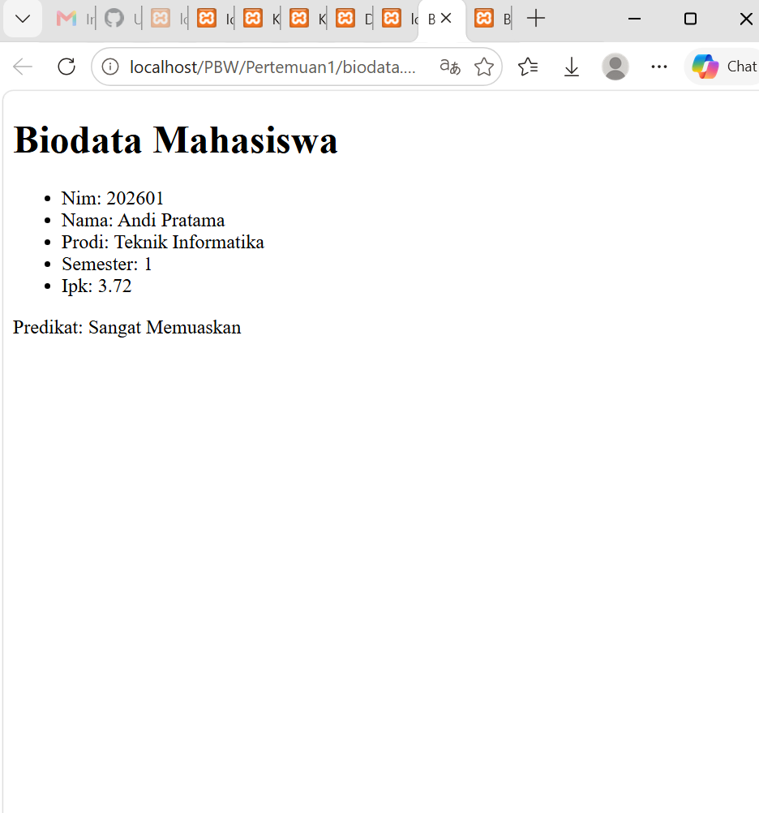
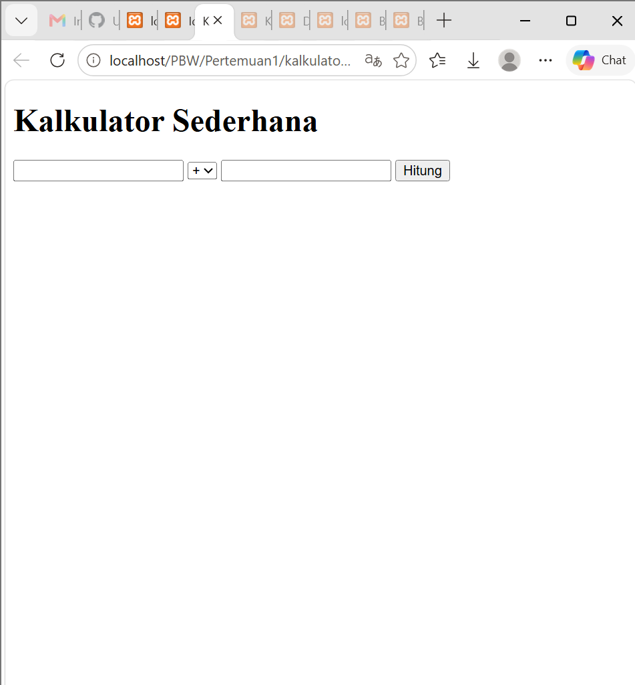
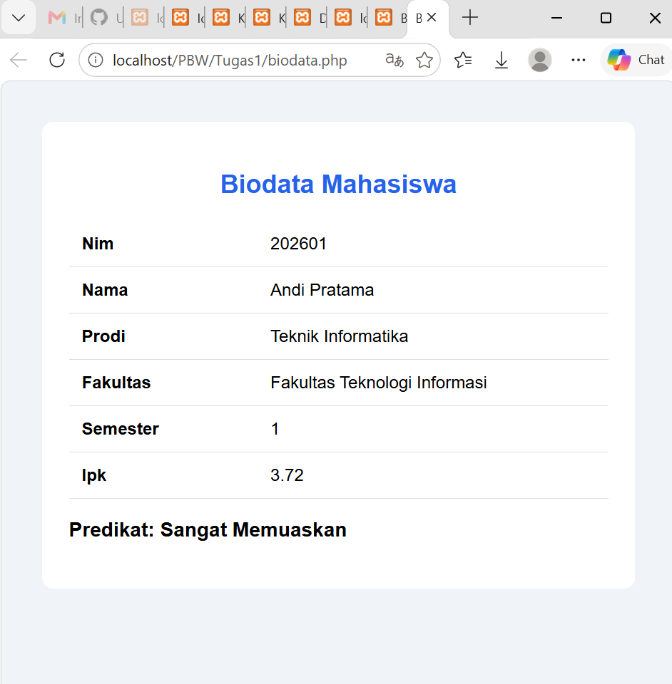
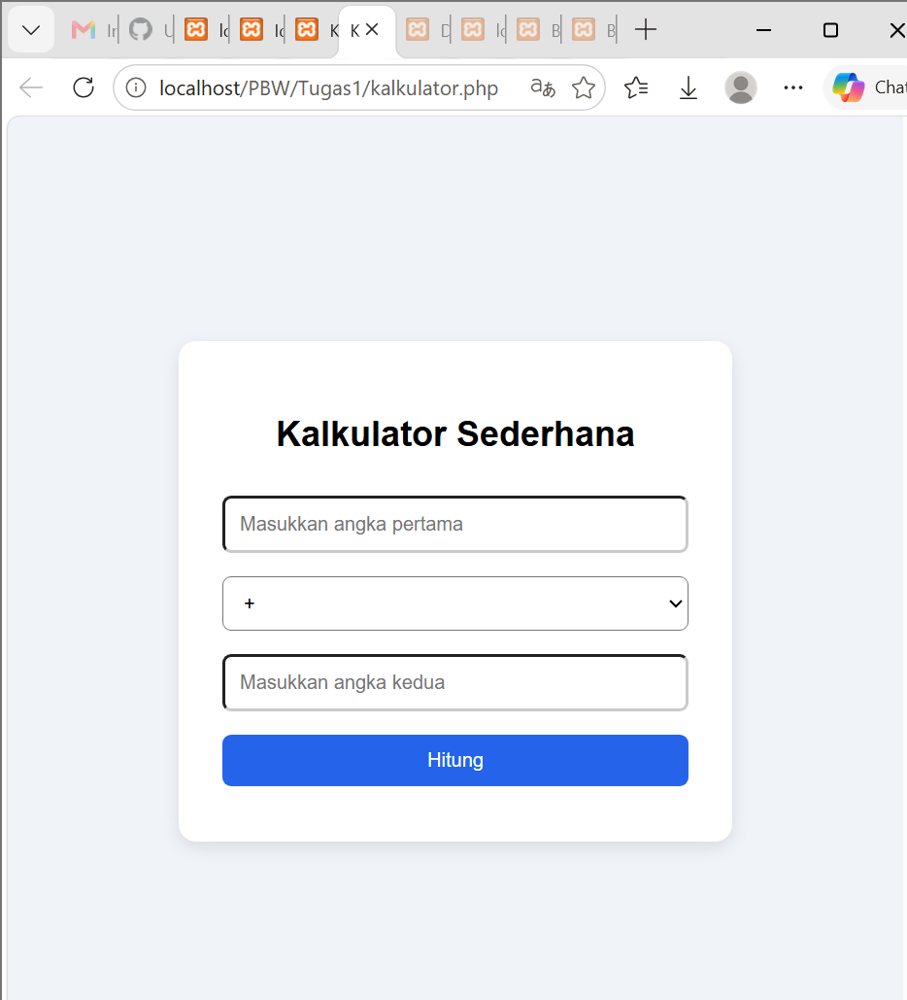

<div align="center">

<h1 style="font-size: 18px; margin-bottom: 5px; border: none;">
LAPORAN PRAKTIKUM <br>
PEMROGRAMAN BERBASIS WEB
</h1>

<p style="font-size: 12px; color: #555;">
<i>"Laporan ini disusun untuk memenuhi salah satu penilaian mata kuliah Praktikum Pemrograman Berbasis Web"</i>
</p>

<br>


<br><br>

<p style="font-size: 14px; margin-bottom: 5px;">
<b>Disusun Oleh:</b>
</p>

<p style="font-size: 15px; margin-top: 5px;">
<b>Rihhadatul Aisy Septifani Zain</b><br>
4524210126
</p>

<br>

<p style="font-size: 14px; margin-bottom: 5px;">
<b>Dosen:</b>
</p>

<p style="font-size: 14px; margin-top: 5px;">
Ari Wibowo, S.Kom., M.Kom., C. Pro
</p>

<br><br><br>

<h3 style="font-size: 16px; margin-bottom: 5px; border: none;">
S1-TEKNIK INFORMATIKA <br>
FAKULTAS TEKNIK UNIVERSITAS PANCASILA <br>
<b>2026/2027</b>
</h3>

</div>

---

# TUGAS 1

## 1. Menjalankan Contoh Program Pertemuan 1

Seluruh contoh program pada Pertemuan 1 dijalankan terlebih dahulu untuk memastikan program dapat menghasilkan output dengan baik dan tidak terdapat error kritis.

### a. Biodata.php

**Tampilan sebelum dilakukan modifikasi:**



### b. Kalkulator.php

**Tampilan sebelum dilakukan modifikasi:**



---

# 2. Modifikasi Program

## A. Modifikasi pada Biodata.php

### Sesudah Modifikasi



### 1.) Menambahkan field fakultas

Field fakultas ditambahkan ke dalam array mahasiswa untuk memberikan informasi yang lebih lengkap. Karena data ditampilkan menggunakan foreach, field baru tersebut akan otomatis ikut ditampilkan.

**Code:**

```php
$mahasiswa = [
    'nim' => '202601',
    'nama' => 'Andi Pratama',
    'prodi' => 'Teknik Informatika',
    'fakultas' => 'Fakultas Teknologi Informasi',
    'semester' => 1,
    'ipk' => 3.72
];
```

### 2.) Menambahkan validasi IPK

Validasi IPK ditambahkan untuk memastikan nilai IPK berada pada rentang 0 sampai 4. Jika nilai yang diberikan berada di luar rentang tersebut, program akan memberikan keterangan bahwa IPK tidak valid.

**Code:**

```php
if ($ipk < 0 || $ipk > 4) {
    return 'IPK tidak valid';
}
```

---

## B. Modifikasi pada Kalkulator.php

### Sesudah Modifikasi



### 1.) Menambahkan validasi input

Validasi digunakan untuk memastikan angka yang dimasukkan oleh pengguna benar-benar berupa angka. Jika input tidak sesuai, program akan menampilkan pesan error.

**Code:**

```php
if (!is_numeric($a) || !is_numeric($b)) {
    $pesan = 'Input harus berupa angka.';
}
```

### 2.) Menambahkan styling CSS

Program Kalkulator diberikan CSS agar tampilan lebih teratur dan nyaman digunakan. Perubahan meliputi background, container, input, tombol, serta tampilan hasil dan pesan error.

---

# 3. Lima Bagian Kode yang Penting

## 1.) Array Asosiatif

Array asosiatif digunakan untuk menyimpan beberapa data mahasiswa dalam satu variabel. Setiap data memiliki key seperti nim, nama, prodi, dan ipk, sehingga data dapat diakses berdasarkan nama key tersebut.

**Code:**

```php
$mahasiswa = [
    'nim' => '202601',
    'nama' => 'Andi Pratama',
    'prodi' => 'Teknik Informatika',
    'fakultas' => 'Fakultas Teknologi Informasi',
    'semester' => 1,
    'ipk' => 3.72
];
```

---

## 2.) Function statusKelulusan()

Function ini digunakan untuk menentukan predikat mahasiswa berdasarkan nilai IPK. Dengan function ini, predikat dapat ditentukan secara otomatis tanpa perlu ditulis secara manual.

**Code:**

```php
function statusKelulusan(float $ipk): string
{
    if ($ipk < 0 || $ipk > 4) {
        return 'IPK tidak valid';
    }

    if ($ipk >= 3.50) {
        return 'Sangat Memuaskan';
    }

    if ($ipk >= 3.00) {
        return 'Memuaskan';
    }

    return 'Perlu Peningkatan';
}
```

---

## 3.) Perulangan foreach

foreach digunakan untuk mengambil dan menampilkan seluruh data yang terdapat di dalam array mahasiswa. Dengan cara ini, tidak perlu menuliskan setiap data satu per satu.

**Code:**

```php
<?php foreach ($mahasiswa as $kunci => $nilai): ?>
    <tr>
        <td><?= htmlspecialchars(ucfirst($kunci)) ?></td>
        <td><?= htmlspecialchars((string)$nilai) ?></td>
    </tr>
<?php endforeach; ?>
```

---

## 4.) Mengambil Data dengan $_POST

$_POST digunakan untuk mengambil data yang dikirimkan melalui form Kalkulator. Operator ?? digunakan untuk memberikan nilai default apabila data belum tersedia, sedangkan (float) digunakan untuk mengubah input menjadi tipe data angka.

**Code:**

```php
$a = $_POST['a'] ?? '';
$b = $_POST['b'] ?? '';
$operator = $_POST['operator'] ?? '+';
```

Kemudian input yang valid akan dikonversi menjadi tipe `float`.

```php
$a = (float) $a;
$b = (float) $b;
```

---

## 5.) Validasi Pembagian dengan Nol

Pada operasi pembagian, dilakukan pengecekan terlebih dahulu untuk memastikan angka kedua tidak bernilai nol. Hal ini dilakukan agar program tidak menghasilkan kesalahan saat melakukan pembagian.

**Code:**

```php
case '/':
    if ($b == 0) {
        $pesan = 'Pembagian dengan nol tidak diperbolehkan.';
    } else {
        $hasil = $a / $b;
    }
    break;
```

---

# Kesimpulan

Dari tugas yang sudah dikerjakan, program Biodata dan Kalkulator berhasil dijalankan dan dimodifikasi sesuai dengan ketentuan tugas. Pada program Biodata, saya menambahkan field fakultas dan validasi IPK. Sedangkan pada program Kalkulator, saya menambahkan validasi input dan membuat tampilannya lebih rapi menggunakan CSS.
