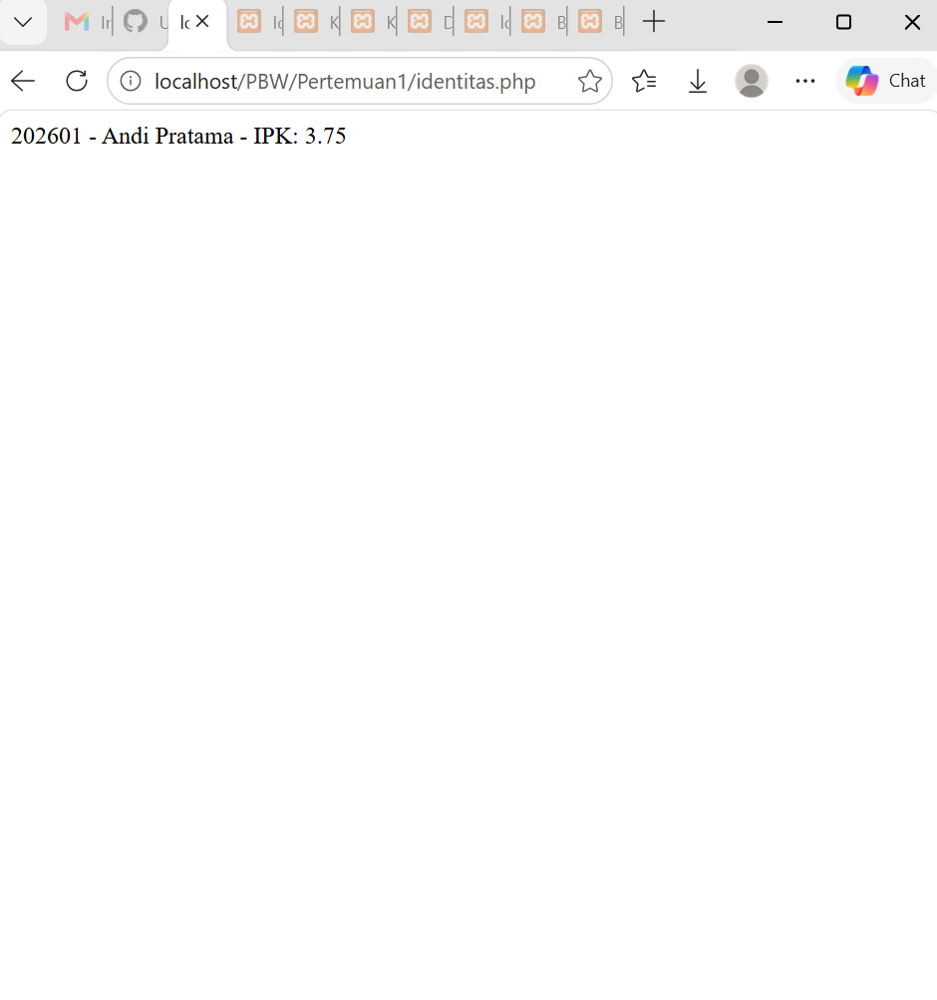
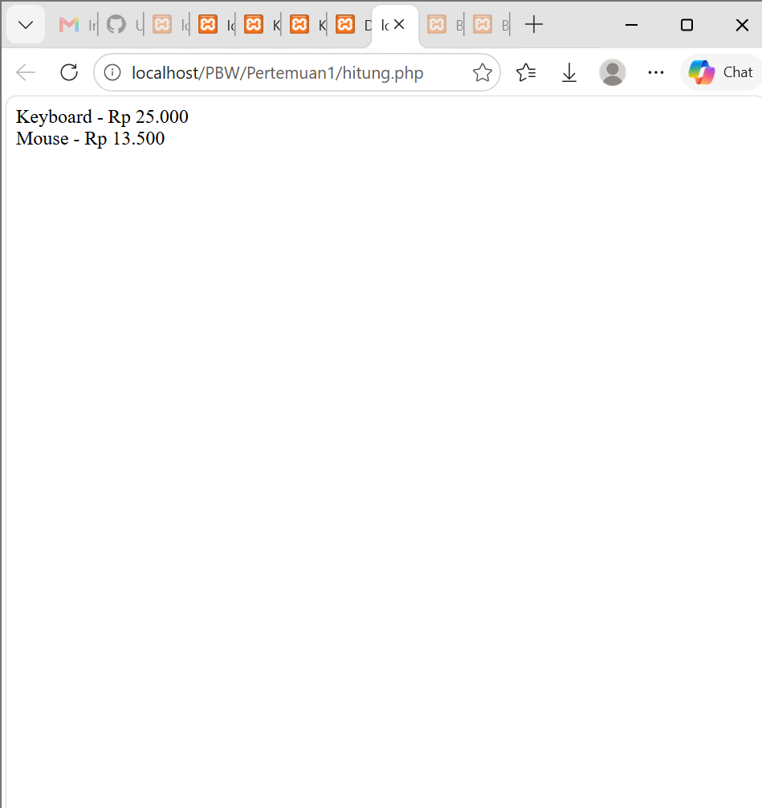
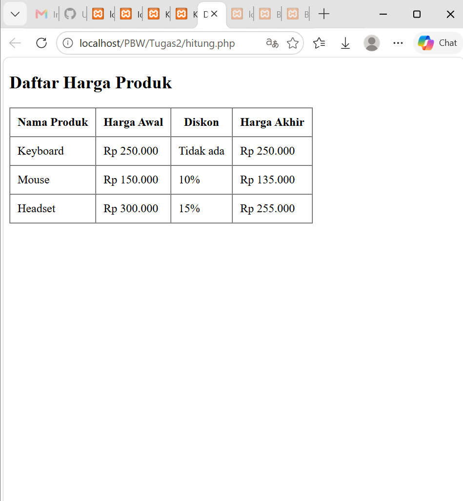
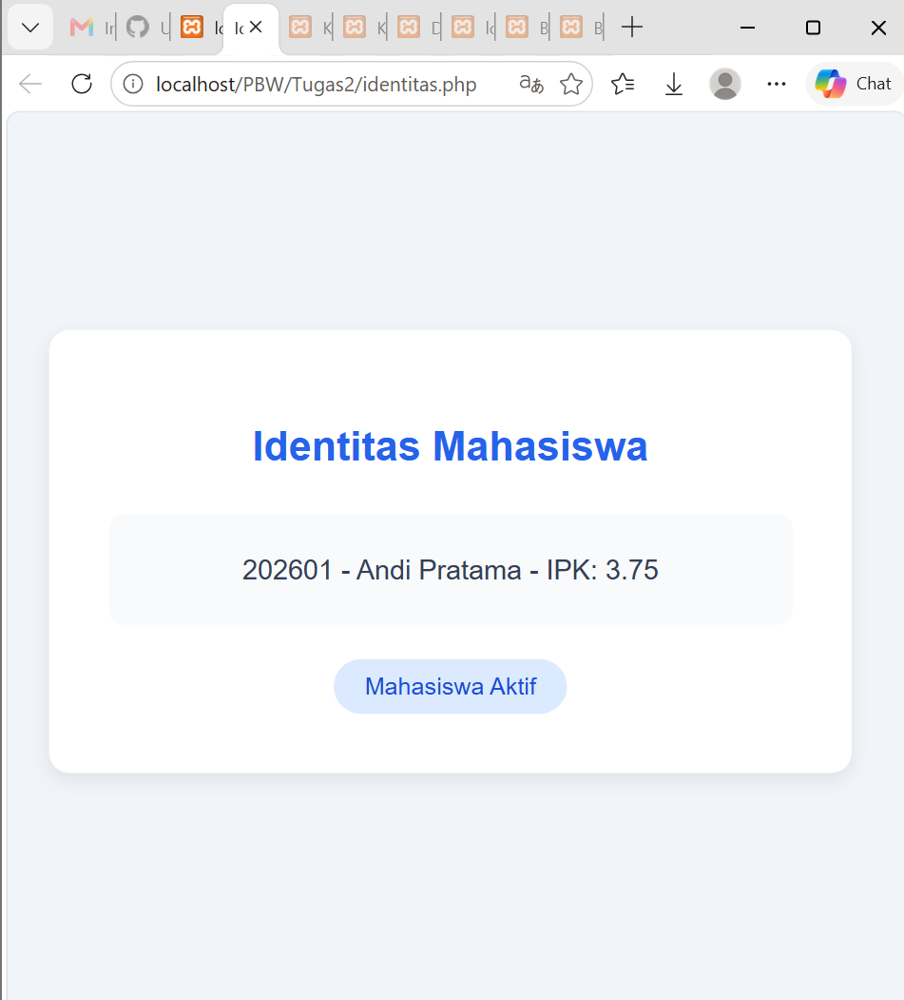

<div align="center">

<h1 style="font-size: 18px; margin-bottom: 5px; border: none;">
LAPORAN PRAKTIKUM <br>
PEMROGRAMAN BERBASIS WEB
</h1>

<p style="font-size: 12px; color: #555;">
<i>"Laporan ini disusun untuk memenuhi salah satu penilaian mata kuliah Praktikum Pemrograman Berbasis Web"</i>
</p>

<br>


<br><br>

<p style="font-size: 14px; margin-bottom: 5px;">
<b>Disusun Oleh:</b>
</p>

<p style="font-size: 15px; margin-top: 5px;">
Rihhadatul Aisy Septifani Zain<br>
4524210126
</p>

<br>

<p style="font-size: 14px; margin-bottom: 5px;">
<b>Dosen:</b>
</p>

<p style="font-size: 14px; margin-top: 5px;">
Ari Wibowo, S.Kom., M.Kom., C. Pro
</p>

<br><br><br>

<h3 style="font-size: 16px; margin-bottom: 5px; border: none;">
S1-TEKNIK INFORMATIKA <br>
FAKULTAS TEKNIK UNIVERSITAS PANCASILA <br>
<b>2026/2027</b>
</h3>

</div>

---

# TUGAS 2

## 1. Menjalankan Contoh Program Pertemuan 2

Seluruh contoh program pada Pertemuan 2 dijalankan terlebih dahulu untuk memastikan program dapat menghasilkan output dengan baik dan tidak terdapat error kritis.

### a. identitas.php

**Tampilan sebelum dilakukan modifikasi:**



### b. hitung.php

**Tampilan sebelum dilakukan modifikasi:**



---

# 2. Modifikasi Program

## A. Modifikasi pada hitung.php

### Sesudah Modifikasi



### 1.) Menambahkan validasi harga

Validasi harga ditambahkan untuk memastikan harga produk tidak boleh memiliki nilai negatif. Jika harga yang dimasukkan kurang dari 0, program akan memberikan pesan error menggunakan InvalidArgumentException.

**Code:**

```php
if ($harga < 0) {
    throw new InvalidArgumentException(
        'Harga tidak boleh negatif.'
    );
}
```

### 2.) Menambahkan validasi diskon

Validasi diskon ditambahkan agar nilai diskon hanya berada pada rentang 0 sampai 100 persen. Hal ini dilakukan supaya nilai diskon yang dimasukkan tetap sesuai.

**Code:**

```php
if ($diskon < 0 || $diskon > 100) {
    throw new InvalidArgumentException(
        'Diskon harus antara 0 sampai 100 persen.'
    );
}
```

### 3.) Menambahkan produk baru

Pada data produk ditambahkan produk **Headset** dengan harga Rp300.000 dan diskon 15%.

**Code:**

```php
$daftar = [
    new Produk('Keyboard', 250000),
    new ProdukDiskon('Mouse', 150000, 10),
    new ProdukDiskon('Headset', 300000, 15)
];
```

### 4.) Mengubah tampilan output menjadi tabel

Output yang sebelumnya hanya menampilkan nama dan harga akhir diubah menjadi tabel yang menampilkan nama produk, harga awal, diskon, dan harga akhir.

---

## B. Modifikasi pada identitas.php

### Sesudah Modifikasi



### 1.) Menambahkan styling CSS

Program diberikan CSS agar tampilan identitas mahasiswa menjadi lebih rapi. Ditambahkan background, card, warna judul, padding, border-radius, dan box-shadow.

### 2.) Menambahkan tampilan badge

Ditambahkan badge **"Mahasiswa Aktif"** di bawah informasi mahasiswa sebagai tambahan pada tampilan halaman.

**Code:**

```html
<div class="badge">
    Mahasiswa Aktif
</div>
```

Dengan adanya perubahan tersebut, tampilan identitas mahasiswa menjadi lebih menarik dibandingkan tampilan awal yang hanya menampilkan teks.

---

# 3. Lima Bagian Kode yang Penting

## 1.) Interface BisaDihitung

Interface BisaDihitung digunakan untuk menentukan bahwa class yang menggunakannya harus memiliki function hargaAkhir(). Interface ini membantu membuat aturan yang sama untuk class `Produk` dan turunannya.

**Code:**

```php
interface BisaDihitung
{
    public function hargaAkhir(): float;
}
```

---

## 2.) Inheritance pada ProdukDiskon

ProdukDiskon merupakan turunan dari class Produk menggunakan extends. Dengan inheritance, ProdukDiskon dapat menggunakan property dan method dari class Produk, kemudian menambahkan fitur diskon.

**Code:**

```php
class ProdukDiskon extends Produk
{
    private float $diskon;
}
```

---

## 3.) Validasi Harga dan Diskon

Validasi digunakan untuk mencegah nilai yang tidak sesuai. Harga tidak boleh negatif, sedangkan diskon harus berada pada rentang 0 sampai 100 persen.

**Code:**

```php
if ($harga < 0) {
    throw new InvalidArgumentException(
        'Harga tidak boleh negatif.'
    );
}
```

```php
if ($diskon < 0 || $diskon > 100) {
    throw new InvalidArgumentException(
        'Diskon harus antara 0 sampai 100 persen.'
    );
}
```

---

## 4.) Perulangan foreach

foreach digunakan untuk mengambil setiap produk yang terdapat dalam array $daftar. Dengan perulangan ini, semua produk dapat ditampilkan ke dalam tabel tanpa harus menuliskannya satu per satu.

**Code:**

```php
<?php foreach ($daftar as $produk): ?>
    <tr>
        <td>
            <?= htmlspecialchars($produk->getNama()) ?>
        </td>
        <td>
            Rp <?= number_format($produk->getHarga(), 0, ',', '.') ?>
        </td>
    </tr>
<?php endforeach; ?>
```

---

## 5.) Function ringkasan()

Function ringkasan() digunakan untuk menggabungkan data NIM, nama, dan IPK mahasiswa menjadi satu teks. Hasil dari function ini kemudian ditampilkan pada halaman identitas.

**Code:**

```php
public function ringkasan(): string
{
    return $this->nim . ' - ' .
        $this->nama . ' - IPK: ' . $this->ipk;
}
```

---

# Kesimpulan

Program hitung.php dan identitas.php berhasil dijalankan dan dimodifikasi. Pada hitung.php saya menambahkan validasi harga dan diskon, menambahkan produk baru, serta membuat hasilnya ditampilkan dalam bentuk tabel. Sedangkan pada identitas.php saya menambahkan CSS dan badge agar tampilannya lebih rapi.
